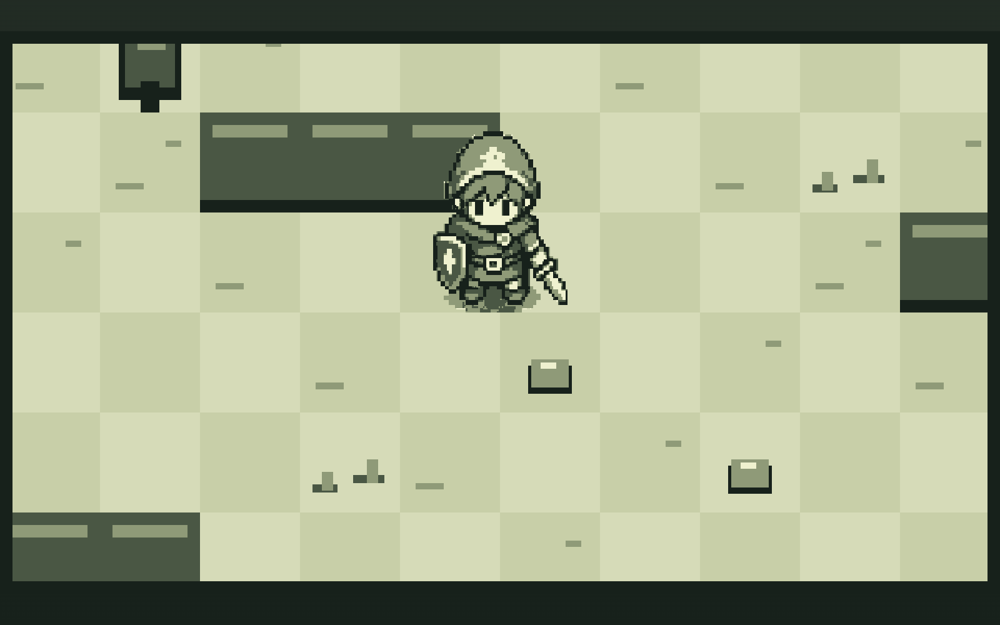
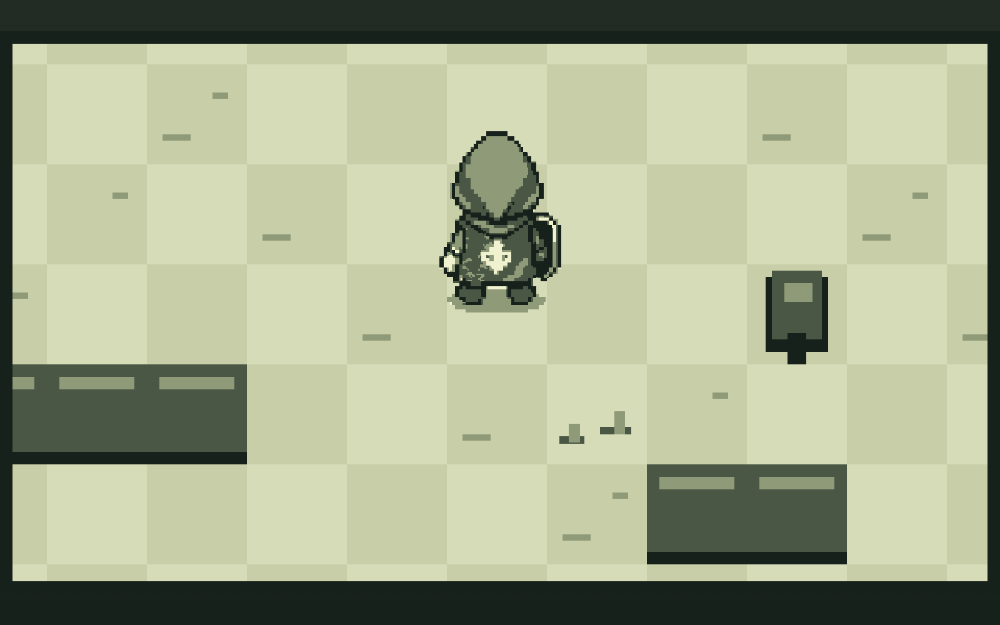

<div align="center">



# 🗡️ Celda

**Un action-RPG top-down con alma de Game Boy, en canvas puro y sin una sola dependencia.**

[](https://gavilanbe.github.io/celda/)


</div>

---

## 🗡️ Qué es esto

Celda es un pequeño action-RPG top-down con estética **Game Boy**, hecho en canvas puro. Controlas a un héroe animado —idle, caminar y ataque en cuatro direcciones, dibujado desde un spritesheet de 128×128— por un mundo de tiles de 64×64 con árboles, piedras y matorrales, todo con colisiones contra sólidos. El render es **pixel-perfect** con escalado nearest-neighbor sobre un viewport lógico de 640×360, y los assets salen de un pipeline de arte propio en Python a la paleta clásica. Incluye una copia vendorizada de la desensamblación `pokered` como referencia de estilo.

## 🎮 Cómo se juega

| Tecla | Acción |
|---|---|
| `↑` `↓` `←` `→` / `W` `A` `S` `D` | Moverse |
| `Espacio` | Atacar |

## 📸 Capturas

| Explorando el mundo | A combatir |
|:--:|:--:|
|  |  |

## ▶️ Jugar

La forma más fácil: **[gavilanbe.github.io/celda](https://gavilanbe.github.io/celda/)**.

### En local

```bash
git clone https://github.com/gavilanbe/celda.git
cd celda
python3 -m http.server 8000
# abre http://localhost:8000

# Regenerar el sprite del héroe (opcional)
python3 scripts/generate-hero.py
```

## 🛠️ Bajo el capó

- **JavaScript (módulos ES)** sobre Canvas 2D, sin dependencias en runtime.
- Render **pixel-perfect**: viewport lógico de 640×360 con escalado nearest-neighbor.
- Héroe animado en cuatro direcciones desde un spritesheet de 128×128; mundo por tiles de 64×64 con colisiones.
- Configuración de juego declarativa en `game.config.json`.
- Pipeline de generación de assets en **Python**; referencia de arte: disassembly `pokered` vendorizada.

## 📦 Créditos

Parte de mi colección de juegos. Publicado por [**@gavilanbe**](https://github.com/gavilanbe).

## 📄 Licencia

[MIT](LICENSE)

<div align="center"><sub>HECHO A MANO · 2026</sub></div>
